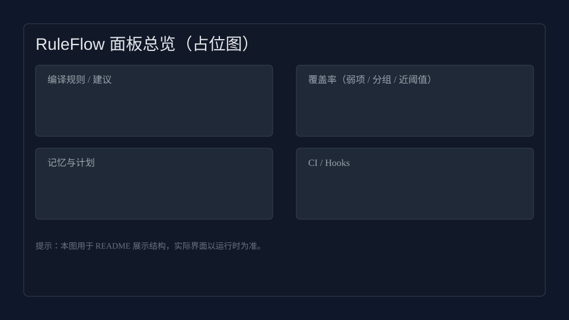
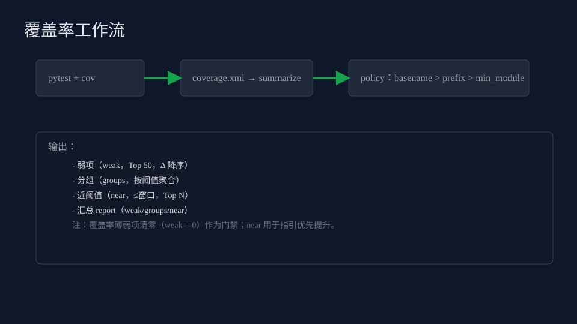

RuleFlow: Open Panel
MCP 规则与上下文助手 / MCP Rules & Context Assistant

以“插件 + MCP Server”模式，提供跨 IDE 的上下文滚动记忆、编程规则强约束、
包裹式改动门禁与性能优先的开发体验。默认启用“快速内环（Fast Inner Loop）”，
将重型检查后移到推送/CI，尽量把保存和小步迭代的开销压到最低。

- 语言 Language: Python (Server) + TypeScript (VS Code extension)
- 模式 Mode: VS Code 插件 + MCP Server（可独立使用 CLI/CI）
- 双语 Bilingual: 所有命令/提示/文档均支持中英文

关键能力 Highlights
- 20 轮滚动记忆（自动压缩/跨项目隔离/关系边）
- 通用规则包 + 项目级规则摄取/去重/冲突检测
- 包裹式改动：写入/提交/推送统一经过门禁（lint/type/test/cov/security）
- 性能优先：保存时仅增量与缓存；重型校验集中在 pre-push/CI
- 自然语言命令（中英双语 + 模糊语义）

两大支柱 / Two Pillars
- 规则与门禁 Rules Enforcement：规则摄取与冲突检测、覆盖率阈值与分组策略、Git Hooks 与 CI 门禁生成/校验。
- 上下文记忆 Context Memory：20 轮滚动记忆与计划资源（memory:// / progress://），在多轮协作中保持一致性与衔接。

功能矩阵 / 支持矩阵 / 无遥测声明
- 运行环境：本地（Python ≥3.10）/ Docker 容器 / CI（GitHub Actions）
- IDE 集成：VS Code（完整）、Cursor/Windsurf（复用 VSIX）、JetBrains（MVP 工具窗口）、Neovim（最小命令）
- MCP/CLI：JSON-RPC/stdio MCP Server + Typer CLI（双语 + 模糊语义）
- 规则门禁：规则摄取/编译/冲突建议 → 配置/CI/Hooks 一致性生成与校验
- 覆盖率：weak/groups/near/tree 汇总；核心模块目标≥98%，其余≥95%（策略可配）
- 安全：bandit（高危阻断）/ semgrep（固定版本，策略可调）/ hadolint（固定镜像标签）
- 遥测：无；仅在工作区写入 `.mcp/` 状态/规则/计划等本地工件

一览 / At a Glance（双语）
- 初始化配置：`mcp-rules-assistant init`（生成 `.mcp/assistant.yaml`）
- 摄取规则：`mcp-rules-assistant ingest-rules README.md docs/`
- 生成/校验 CI：`mcp-rules-assistant generate-ci && mcp-rules-assistant ci-validate`
- 钩子安装：`mcp-rules-assistant install-hooks`（首次务必执行；提交信息需包含 `[step:...]`）
- 覆盖率：`PYTEST_DISABLE_PLUGIN_AUTOLOAD=1 pytest -q -p pytest_cov --cov=mcp_rules_assistant --cov-report=xml:coverage.xml`
- 状态刷新：`mcp-rules-assistant status-update`（写入 `.mcp/dashboard/status.json`）
- 诊断打包：`mcp-rules-assistant diagnose-bundle`（收集 coverage/pytest/near/.mcp 状态与规则/计划 → 生成 tar.gz）
- VS Code 面板：命令 `RuleFlow: Open Panel`；自然语言 `RuleFlow: Natural Command`
 - JetBrains 插件：见 `extensions/jetbrains/README.md`（工具窗口最小直连 MCP：启动/停止/Ping/资源/计划/摄取/覆盖率/CI/受控写入）

本地安装验证（不发布）
- 可编辑安装：`pip install -e .`，验证：`mcp-rules-assistant version`
- 打包安装：
  - 构建：`python -m build`
  - 安装：`pip install dist/mcp_rules_assistant-<ver>-py3-none-any.whl`
  - 验证：`mcp-rules-assistant status-update --json`
  - 卸载：`pip uninstall -y mcp-rules-assistant`

状态 Status


（Codecov 说明：公共仓库默认无需 token；私有仓库需在 CI 配置 `CODECOV_TOKEN`，本仓库工作流已在无 token 时降级为“尽力而为，不阻断”。）


提示：`docs/CI_HEALTH_CHECK.md` 为 CI 健康检查说明文档（包含必备检查、触发方式与常见失败定位）。CI 工作流支持 `workflow_dispatch`，可在 GitHub Actions 页面手动触发一次完整构建（包含 VS Code 无头测试与门禁）。

近阈值窗口（near）与 CI 说明
- 默认示例使用 3% 窗口；本仓库为抛光核心模块将 `coverage.near.within` 覆盖为 1.0%（0.01）。可用命令快速调整：`mcp-rules-assistant coverage-near-set --within 3 --top 20`。
- CI 已包含 JetBrains 最小 smoke：读取 `.mcp/dashboard/status.json` 并校验关键字段；对应工件会随构建上传（见 `jetbrains-storyboard` 作业）。

示意图 / Screenshots



JetBrains 截图（预览）


没有安装 JetBrains? 可使用“无 IDE 替代方案（Storyboard）”直接生成等价的数据样例，见 `docs/IDE_JB_STORYBOARD.md`。

JetBrains 打包与最小 E2E
- 打包：`sh scripts/jb-package.sh`（生成于 `extensions/jetbrains/build/distributions`）
- 最小 E2E（CI/本地）：运行 JetBrains 测试（包含对 `.mcp/dashboard/status.json`/mock 的 smoke 断言）：
  - Docker：`docker compose run --rm jb-test`
  - CI：见 `jetbrains-tests` 作业（非阻断）

JetBrains 头less UI Smoke（可选）
- 本地（容器）运行：`docker compose run --rm jb-ui-smoke`（timeboxed 约 20s，日志输出至 `extensions/jetbrains/ui_smoke.log`）
- CI 作业：`jetbrains-ui-smoke`（非阻断），自动上传 smoke 日志工件



覆盖率门禁 Coverage Gate
- Python（门槛与策略）：核心≥98%，其余≥95%；coverage-report 弱项清零（weak 列表为空）。
- VS Code 前端（阶段性）：CI 默认对 lcov 执行≥80% 的“非阻断”检查（仅警告）；可通过设置 `VSCODE_COVERAGE_GATE=1` 启用同阈值硬门禁，后续逐步提升至 90%/95%。
 - 小贴士（coverage.policy 命中策略）：policy 键既支持“目录前缀”也支持“文件名后缀（basename）”。
   - 对单个关键模块设更高门槛，推荐直接使用文件名后缀（如 `mcp_server.py: 0.99`）。
   - 对一类目录设默认门槛，使用目录前缀（如 `mcp_rules_assistant/`: 0.95）。
 - 小贴士（近阈值 near 窗口）：文档示例为 3%，本仓库覆盖为 1.0%（`coverage.near.within=0.01`）。可用 `mcp-rules-assistant coverage-near-set --within 3 --top 20` 调整。

覆盖率策略（示例）
```yaml
coverage:
  policy:
    # 目录前缀（应用于整类目录）
    mcp_rules_assistant/: 0.95
    # 文件名后缀（更精确，推荐用于关键模块）
    cli.py: 0.98
    mcp_server.py: 0.99
```

容器内一键验证
- 运行完整预检 + 测试 + 覆盖率门禁 + dev-agent smoke：`docker compose run --rm verify`

许可与试用 License & Trial
- 本产品为商业授权（全部功能付费，含 7 天试用）；详见 `docs/PRICING.md`
- 激活：`mcp-rules-assistant license-status` 查看状态；`mcp-rules-assistant license-activate --file <path>` 将许可文件复制到 `~/.mcp/license.json`
- 校验：`mcp-rules-assistant license-verify` 查看签名/有效期是否有效（支持 hs256/rs256）
- 发行（离线）：`mcp-rules-assistant license-generate --issued-to Alice --expires 2026-01-01 --alg hs256 --out lic.json`
  - hs256：默认使用 `MCP_LICENSE_SALT`（可选）计算签名（演示）
  - rs256：提供私钥 `--private-key private.pem` 生成；设置 `MCP_LICENSE_PUBKEY` 公钥进行校验
- 提示：完整的“激活与门禁验证”流程（含发布硬门禁开关与 e2e 验证）见 `docs/USAGE.md` 与 `docs/DEPLOYMENT_PLAN.md`
 - 验证摘要：CI 会生成 `.mcp/dashboard/release_check.md`（也可在本地运行 `sh scripts/release-harden-verify.sh` 生成）

快速开始 Quick Start（性能优先）
三步极简上手（Minimal 3 steps）
1) 初始化与规则摄取：`mcp-rules-assistant init && mcp-rules-assistant ingest-rules README.md docs/`
2) 生成并校验 CI：`mcp-rules-assistant generate-ci && mcp-rules-assistant ci-validate`
3) 加载覆盖率与状态：`PYTEST_DISABLE_PLUGIN_AUTOLOAD=1 pytest -q -p pytest_cov --cov=mcp_rules_assistant --cov-report=xml:coverage.xml && mcp-rules-assistant status-update`

（五步快速上手）
- 初始化与规则摄取：`mcp-rules-assistant init && mcp-rules-assistant ingest-rules README.md docs/`
- 安装本地钩子：`mcp-rules-assistant install-hooks`
- 生成并校验 CI：`mcp-rules-assistant generate-ci && mcp-rules-assistant ci-validate`
- 运行测试与覆盖率：`PYTEST_DISABLE_PLUGIN_AUTOLOAD=1 pytest -q -p pytest_cov --cov=mcp_rules_assistant --cov-report=xml:coverage.xml`
- 刷新状态（新窗口也适用）：`mcp-rules-assistant status-update`（或 `python3 -m mcp_rules_assistant.cli status-update`）
- 安装：`pip install -e .`（开发模式）
- 初始化：`mcp-rules-assistant init`（生成 `.mcp/assistant.yaml`）
- 查看性能模式：`mcp-rules-assistant explain-performance`
- 启动 MCP 服务：`mcp-rules-assistant start`
- VS Code：
  - 打开“RuleFlow: Open Panel”（或点击状态栏左侧“RuleFlow”）
  - 自然语言：执行“RuleFlow: Natural Command”，输入“摄取规则 README.md, docs/ / 加载覆盖率 / 开启滚动记忆”等
- 环境准备（可选）：`mcp-rules-assistant prepare-env --install`（或 `--dry-run` 查看计划）
- 一键维护：`python -m mcp_rules_assistant.cli maintenance`（安装 hooks + 自修复 CI）
- 预检（无人值守快照）：`make preflight`
- 本机安装验证（CLI + 面板）一页流：
  - `pip install -e .`
  - `mcp-rules-assistant init && mcp-rules-assistant install-hooks`
  - 运行测试生成 `coverage.xml`
  - VS Code：`npm --prefix extensions/vscode run compile` → F5 启动“扩展开发主机” → `RuleFlow: Open Panel`
  - 面板：执行“摄取规则/加载覆盖率/生成或校验 CI（预览成功即通过）”
 - 安装钩子（回退）：`make hooks-sh`（无 Python 环境）

文档 Docs（入口：`DEVELOPMENT.md`）
（快速入口：`DEVELOPMENT.md` | `docs/IDE_SCAFFOLD.md` | `docs/USAGE.md`）
- 插件化路线：`docs/IDE_PLUGIN_ROADMAP.md`
- DEVELOPMENT：`DEVELOPMENT.md`（开发入口 / TDD 计划 / AI 约束 / 文档索引）
- docs/ARCHITECTURE.md：架构与模块
- docs/PERFORMANCE.md：性能模式与触发点（默认 Fast）
- docs/CONFIG.md：配置与双语命令触发
- docs/USAGE.md：常用使用示例与流程
- docs/RULESETS.md：规则包与选择器
- docs/HOOKS.md：Git hooks 与 CI 生成
- docs/RULES_INGEST.md：规则摄取与校验
- docs/SECURITY_TOOLS.md：安全工具示例（hadolint/semgrep）
 - extensions/vscode/README.md：插件说明
- PRICING：`docs/PRICING.md`（定价与许可、试用政策）
- 商业化与结算：采用 MoR（Lemon Squeezy / Paddle），USD 计价、自动本地化与税务处理
- IDE 集成指南：
- 多 IDE 最小集成：`mcp-rules-assistant ide-scaffold --editor <vscode|cursor|jetbrains|neovim>`（生成至 `.mcp/ide/<editor>/`）
- 文档指引：`docs/IDE_SCAFFOLD.md`（各 IDE 集成与使用说明）
- 合规承诺：`mcp-rules-assistant compliance-commitment --out COMMITMENT.md`（或默认写入 `.mcp/compliance.md`）
- Copilot 集成（可选）：已在 `.vscode/settings.json` 预置 `copilot.mcp.tools.ruleflow`，加载后 Copilot MCP 面板可显示本工具，聊天将按需调用。
- 详细步骤：`docs/COPILOT_MCP.md`
 - 自然语言清单：`docs/NATURAL_LANGUAGE.md`

测试与覆盖率 Tests & Coverage
- 本地运行（严格模式，无警告/跳过；覆盖率门槛以 `.mcp/assistant.yaml` 为准）：
  - 创建环境并安装依赖（任选其一）
    - `pip install -e . && pip install -U pytest pytest-cov ruff black isort mypy bandit`
    - 或 `make setup`（使用内置 .mcp/venv）
  - 运行测试：
    - `pytest -q --maxfail=1 --disable-warnings -W error --strict-markers --cov=mcp_rules_assistant --cov-report=term-missing --cov-fail-under=<阈值>`
  - 清理覆盖率缓存：`mcp-rules-assistant coverage-clean-cache`
- CI 中按项目配置的 `coverage.min_module` 动态设置门槛（默认值见配置），并上传 `coverage.xml` 到 Codecov 以生成覆盖率徽章。

说明（测试样例文件）
- 测试中涉及的示例文件已内置于测试逻辑中创建；仓库根目录不再保留 `bad.py`、`foo.py`、`ok2.py`。

 - Codecov 上传
   - CI 已配置条件上传步骤：
     - 公共仓库：如安装了 Codecov GitHub App，可在无 token 情况下上传（推荐）。
     - 私有仓库：在 GitHub → Settings → Secrets and variables → Actions 配置 `CODECOV_TOKEN`。
     - 上传失败不阻断 CI（`fail_ci_if_error: false`），但建议按需修复以保障徽章与历史数据。
   - 首次 push 后可访问徽章链接确认数据是否入库：
  - https://codecov.io/gh/efem1978/Contextual-Cohesion-and-Programming-Rules-Assistant-MCP-Tool

性能与约束 Performance & Enforcement
- 默认 Fast：保存仅格式化+改动文件 lint；提交增量；推送/CI 才跑重型门禁
- 可切换 Standard/Strict；企业/机构建议 Strict（含变异测试）
 - 受影响测试：受控写入的 quick tests 使用启发式（文件名映射/导入引用）+“上次失败缓存”（`.mcp/last_failed_tests.json`）优先跑高风险测试，进一步降低本地等待时间

Hooks & CI（最小闭环）
- 安装钩子：`mcp-rules-assistant install-hooks`
- 生成 CI：`mcp-rules-assistant generate-ci`
 - CI 将包含 `prepare` 作业：调用 `env.prepare` 创建 `.mcp/venv` 并在 venv 中执行 pytest+覆盖率
 - 版本固定：CI 固定 `hadolint` 镜像标签与 `semgrep`/`bandit` 版本，提升可重复性
- 提交信息约束：计划处于 in_progress，提交信息需包含 `[step:当前步骤]`
  - 快速示例：
    - 切换为进行中并设定步骤：`mcp-rules-assistant plan-set --status in_progress --current "<步骤>"`
    - 提交时在消息中带标记：`git commit -m "feat: xxx [step:<步骤>]"`
    - 任务完成后可关闭：`mcp-rules-assistant plan-done`
- 自动增强：若已摄取规则包含 `security.secrets_scan`/`container.required` 等，将自动加入 detect-secrets（push 阶段）与 Dockerfile 检查等步骤（CI），不影响保存性能
 - 可配置：`ci.hadolint: true`（容器存在时在 CI 中运行 hadolint）；`ci.semgrep_config: auto|自定义规则集`，`ci.hadolint_image/ci.hadolint_args` 可调
 - 近阈值摘要：CI 在 Python 测试后打印 `coverage-near --within 3 --top 10` 结果，用于在 PR 中快速识别“接近阈值”的文件并优先补测
 - 首次使用建议：执行一次 `mcp-rules-assistant install-hooks`，该命令会写入本地脚本（如 `.mcp/plan_gate.py`）并尝试执行 `pre-commit install`（含 commit-msg、pre-push）。若未安装 pre-commit，请先运行 `pip install pre-commit`。

规则摄取（项目级）
- CLI：`mcp-rules-assistant ingest-rules <文件或目录>` → 写入 `.mcp/rules_compiled.*`（含冲突报告）
- MCP：`tools/call rules.ingest { paths: [...] }`，`resources/read rules://project/<id>/compiled`、`.../compiled.json` 与 `.../suggestions`

VS Code 插件（软拦截）
- 打开面板：命令“MCP: Open Panel”，可一键“摄取/校验/载入规则/载入建议”，支持冲突定位与跳转
- 软拦截提交：命令“MCP: Commit (run checks)”（运行 pre-commit 提交阶段并提交）
- 软拦截推送：命令“MCP: Push (run gates)”（触发 pre-push 钩子跑重型门禁）
- 加载覆盖率：面板按钮“加载覆盖率 / Load Coverage”，展示 coverage.xml 产生的薄弱模块
- 覆盖率分组：面板展示“覆盖率分组”，可按策略前缀过滤薄弱文件
- 覆盖率目录树：面板展示“覆盖率目录树（弱项）”，按目录层级折叠浏览并跳转
 - 近阈值：点击“仅看近阈值 / Show Near”可输入窗口（默认 3%），仅显示接近阈值的文件；加载覆盖率时也会自动统计近阈值数量
 - CI 配置：面板提供 hadolint/semgrep 的开关与参数，保存即更新 `.mcp/assistant.yaml`；可一键“生成 CI”
 - 信息条与快速操作：面板顶部有“信息条”，在资源缺失时提示原因与下一步操作；当缺少规则/建议时，会插入“快速摄取 / Quick Ingest”按钮便捷触发摄取。
 - Python 解释器：扩展默认在非 Windows 平台使用 `python3` 启动服务器；可通过环境变量 `MCP_PYTHON_BIN` 覆盖
 - 手测指南：见 `docs/VS_CODE_TEST.md`

记忆与计划（可读可机读）
- 记忆：`resources/read memory://<id>/rollup`（最近 20 轮 JSON）→ 面板“加载记忆”查看
- 计划：`resources/read progress://<id>/plan`（Markdown）→ 面板“加载计划”查看；CLI 有 `plan-init/plan-update`
 - 面板计划操作：可标记“进行中/完成”，并更新“当前步骤”

覆盖率 CLI
- `mcp-rules-assistant coverage`：薄弱文件 Top 20
- `mcp-rules-assistant coverage-groups`：按模块策略分组摘要
- `mcp-rules-assistant coverage-tree`：按目录构建薄弱文件树（前3层）
- `mcp-rules-assistant coverage-near --within 3 --top 20`：近阈值清单（未低于阈值但距离≤3% 的文件）
- `mcp-rules-assistant coverage-near-set --within 5 --top 10`：设置近阈值窗口（百分比）与 Top N，面板“加载覆盖率”与 MCP 资源 `coverage://.../near` 将自动应用
- `mcp-rules-assistant coverage-report --json`：一次性输出弱项/分组/近阈值（默认 JSON）
- `mcp-rules-assistant coverage-clean-cache`：删除覆盖率解析缓存 `.mcp/coverage_cache.json`

错误码约定（JSON-RPC）
- 服务器在 stdio JSON-RPC 层对错误进行分层：
  - -32601：method not found（未知方法）
  - -32602：invalid params / 语义校验失败（参数缺失/无效）
  - -32603：internal error（内部错误）
  - -32000：Unknown resource uri（历史兼容约定）
  - -32001：resource not found（文件/资源缺失）
- 详见：`docs/MCP.md`

受限环境 VS Code 测试提示
- 若 `npm --prefix extensions/vscode test` 在本机失败：
  - 尝试清空默认启动参数：`export MCP_VSCODE_TEST_ARGS=""`
  - 或自定义启动参数（逗号分隔）：`export MCP_VSCODE_TEST_ARGS="--disable-extensions"`
  - 然后重试：`npm --prefix extensions/vscode test`
  - 详见 `docs/VS_CODE_TEST.md`

一页流（从摄取到门禁）
- 摄取规则：`mcp-rules-assistant ingest-rules <文件或目录>`
- 解释规则：`mcp-rules-assistant rules-explain`（或 `--json --with-suggestions short`）
- 应用门禁：`mcp-rules-assistant enforce`（输出门禁摘要；如提示需要，执行下面两步）
- 生成 CI：`mcp-rules-assistant generate-ci`
- 安装钩子：`mcp-rules-assistant install-hooks`
- 覆盖率与近阈值：`mcp-rules-assistant coverage` / `coverage-near --within 3 --top 20`
 - 建议导出：`mcp-rules-assistant rules-suggestions --format json|csv`
- 环境诊断：`mcp-rules-assistant diagnose --json`（默认 JSON；或加 `--text`）
- 诊断打包：`mcp-rules-assistant diagnose-bundle`（生成 `diagnostics-<ts>.tar.gz`）
 - 刷新状态：`mcp-rules-assistant status-update`（将计划/覆盖率/记忆汇总到 `.mcp/dashboard/status.json`）

示例 Examples
```bash
# 摄取规则与生成建议
mcp-rules-assistant ingest-rules README.md docs/
mcp-rules-assistant rules-explain --json --with-suggestions short

# 覆盖率报告（弱项/分组/近阈值）
mcp-rules-assistant coverage-report --json > coverage_report.json

# 导出建议（CSV）
mcp-rules-assistant rules-suggestions --format csv --output suggestions.csv

# 环境诊断
mcp-rules-assistant diagnose --json > diagnose.json

# 混合摄取（多个文件与目录）
mcp-rules-assistant ingest-rules README.md docs/ ARCHITECTURE.md rules/
```

快捷操作 Makefile（可选）
- 一键环境准备：`make setup`
- 本地测试（禁用外部 PyTest 插件）：`make test`
- 生成与校验 CI：`make ci`

Docker 辅助（可选）
- 开发代理：`docker compose up --build dev-agent`（落盘状态文件，无前端）
- VS Code 扩展无头测试：`docker compose run --rm vscode-test`
- JetBrains 构建环境占位：`docker compose run --rm jb-build`
- JetBrains Gradle 测试（headless smoke）：`docker compose run --rm jb-test`
- VS Code 扩展测试：`make vscode-test`（若受限可先 `export MCP_VSCODE_TEST_ARGS=""`）
- IDE 兼容性自检：`make ide-compat`（编译 VS Code 扩展 + 无头测试，输出 `extensions/compat_report.json`；macOS 场景下 tests_status=skipped 属正常，详见 `docs/VS_CODE_TEST.md`）
- 打包 VSIX（供 Cursor/Windsurf 本地安装）：`npm --prefix extensions/vscode run package`；在 Cursor/Windsurf 扩展面板选择“Install from VSIX…”，选取生成的 `.vsix`（详见 `extensions/cursor/README.md`、`extensions/windsurf/README.md`）
 - 产物目录：执行 `make ide-compat` 后，`extensions/artifacts/` 将包含 `compat_report.json` 与最新 VSIX（如打包成功），便于一次打包/分发
- 规则摄取：`make ingest`
- 覆盖率摘要：`make coverage`
- 本地 CI 一键执行：`make local-ci-run`（聚合 lint/type/tests/coverage‑gate，与 CI 门禁一致）

发行流程清单 Release Checklist（建议）
- 版本与日志：
  - 同步 `pyproject.toml` 与 `mcp_rules_assistant/__init__.py` 版本号
  - 更新 `CHANGELOG.md`（概述变更/兼容性/迁移说明）
- 质量门禁：
  - `make local-ci-run` 全绿，`coverage-report --json` weak=0
- VS Code：`npm --prefix extensions/vscode test` 生成 lcov；默认阈值≥80%（非阻断，CI 将输出近阈值与最低覆盖的文件清单）；如启用硬门禁需达标

本地生成发布正文（示例，一键三步）
```
make release-simulate
make release-note-full
sh scripts/release-compose-body.sh
```
- 许可硬化（如需商业发布）：
  - `make release-harden-verify` 一键验证（开启 license.required → MCP 敏感工具受限 → 关闭）
- 打包核验：
  - Python 包：`make package && make release-check`（`twine check` 通过；含 `py.typed`）
  - VS Code 扩展：`npm --prefix extensions/vscode run package` 生成 `.vsix`（可选）
- CI 状态：
  - GitHub Actions 全部通过（含 SAST/hadolint/Mutation 可选/IDE 兼容脚本）
- 标签与发布：
  - 打 tag：`git tag vX.Y.Z && git push --tags`（或使用 Release 工作流）
  - PyPI/VS Code 市场发布（如适用），并在 README 更新安装指引与版本徽章
- IDE 兼容性自检：`make ide-compat`（编译 VS Code 扩展 + 无头测试，并输出 `extensions/compat_report.json`；供 Cursor/Windsurf 参考）

许可证与商业化
- 预留本地授权/离线激活能力接口（见 docs/ARCHITECTURE.md）。
- 默认不开启任何遥测；所有数据本地优先存储。

调试与可观测性 Debug & Observability
- 统一执行器：所有外部命令通过 `process.run_cmd` 调用（默认超时 300s，支持 retries/backoff）。
- 事件钩子：`run_cmd(..., on_event=callback)` 可获取 start/end/error 事件（含耗时/返回码）。
- 即时日志：设置 `MCP_RUN_CMD_LOG=1` 或参数 `log=True` 可在控制台输出 start/end/error 摘要。
- 周期事件：Dev Agent 将本轮命令事件落盘至 `.mcp/dashboard/cmd_events.json`（最近 200 条）与 `cmd_events.jsonl`（追加）。

不提交的生成物（请勿入库）
- `coverage.xml`、`.coverage*`、`cov*.json`、`pytest-junit.xml`
- VS Code 产物与包：`extensions/vscode/out/`、`extensions/vscode/coverage/`、`*.vsix`
- 其他临时目录：`.mypy_cache/`、`.ruff_cache/`、`.pytest_cache/`、`dist/`、`build/`
（仓库已在 `.gitignore` 与 `scripts/preflight.sh` 做了兜底）
- CI 注释：Bandit 对高严重度或常见规则（B101/B404/B603/B110/B112）自动输出 GitHub Actions 警告注释（文件/行/标题/摘要）。
